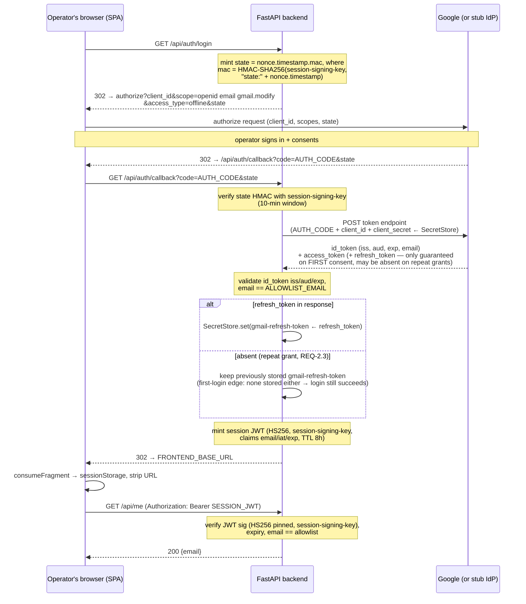

# Spec: Authentication (Google OAuth broker + JWT-gated dashboard)

> **Created:** 2026-07-11 · **Updated:** 2026-07-14 (implemented)
> **Status:** Complete — Gate 2 verdict ALIGNED (2026-07-14); manual real-Google smoke
> deferred to deploy time
> **Mode:** Lite (single-file spec per constitution P9, amended 2026-07-14)
> **Steering:** D3, D17, D18, D19, D22, D25 (tech.md); Authentication + Secrets sections
> of [azure-implementation.md](../azure-implementation.md)

## Overview

Implements the decided auth architecture: a **single Google consent** providing dashboard
identity and Gmail access (D18), brokered by our own backend (not SWA built-in auth),
gated by a **single-email allowlist** (D17), with the session carried as a
**backend-minted JWT in the `Authorization: Bearer` header** (D22; the 8-hour TTL and
HS256 are grilling resolutions of 2026-07-11, not part of D22). The Gmail
**refresh token** is stored behind a new **SecretStore abstraction** (gitignored file in
dev, Key Vault in production — Key Vault class deferred to the infra feature).

Reviewed 2026-07-14 by two independent critics (steering compliance + devils advocate);
their triaged findings are incorporated below (see Decision history).

---

## Requirements

**Personas:** Operator (single allowlisted user, owner of the monitored mailbox);
unauthorized visitor (everyone else — must get nothing).

### REQ-1: Login initiation

**User Story:** As the operator, I want one Google consent for dashboard access + Gmail
grant.

1. WHEN an unauthenticated user loads the dashboard
   THE SYSTEM SHALL render a login screen with a "Sign in with Google" action and no
   dashboard data.
2. WHEN the user activates "Sign in with Google"
   THE SYSTEM SHALL redirect to Google's authorization endpoint with scopes
   `openid email https://www.googleapis.com/auth/gmail.modify` (D19),
   `access_type=offline`, and a **self-validating `state`** =
   HMAC(session signing key, nonce + timestamp).
   *No forced `prompt=consent`* — re-consent only on token staleness, per D18; the future
   "Reconnect Gmail" flow owns forced re-consent.
3. THE SYSTEM SHALL read Google's authorization and token endpoint URLs from deploy-time
   configuration only (never request-influenced), so tests can substitute a stub IdP.

### REQ-2: OAuth callback — exchange, allowlist, session mint

**User Story:** As the operator, I want the backend to complete the Google flow so I never
handle OAuth credentials.

1. WHEN the callback receives a `code` with a `state` whose HMAC verifies and whose
   timestamp is within 10 minutes
   THE SYSTEM SHALL exchange the code at the configured token endpoint (client secret
   read from the secret store) and validate the returned `id_token` **claims**: `iss`,
   `aud` = our client_id, `exp`; extract the email. Signature trust derives from fetching
   the token directly over TLS from the configured endpoint (OIDC direct-channel rule).
2. WHEN the authenticated email equals the allowlisted operator email (D17, env setting
   per D25)
   THE SYSTEM SHALL store the returned Gmail refresh token in the secret store, mint an
   8-hour session JWT, and redirect to the **fixed, configured** SPA URL with the JWT in
   the URL fragment (`#token=…`). The redirect target SHALL never derive from request
   parameters.
3. WHEN the token response contains no `refresh_token`
   THE SYSTEM SHALL keep the previously stored refresh token (Google may omit it on
   repeat grants) and continue the login normally. First-login edge: if none is stored
   either, login still succeeds — the Gmail grant stays absent until a later login (or
   the future Reconnect flow) supplies it.
4. WHEN the callback receives `error=access_denied` (operator cancelled at Google), a
   missing/invalid/expired `state`, an invalid `code`, or a failed exchange
   THE SYSTEM SHALL NOT mint a JWT and SHALL redirect to the SPA with a generic error
   fragment (`#error=login_failed`), storing nothing.
5. WHEN the authenticated email is NOT the allowlisted email
   THE SYSTEM SHALL NOT mint a JWT, SHALL NOT store the refresh token, and SHALL redirect
   with `#error=unauthorized` — without revealing the allowlisted address.

### REQ-3: JWT-gated API (D22)

**User Story:** As the operator, I want every endpoint except health to require my
session.

1. WHEN a protected request carries a Bearer JWT that verifies with **pinned
   `algorithms=["HS256"]`**, is unexpired, and whose email claim equals the allowlisted
   email
   THE SYSTEM SHALL process the request. (Per-request allowlist check per
   azure-implementation.md "signature + expiry + allowlisted email".)
2. WHEN the JWT is missing, malformed, expired, wrong-signature, wrong-algorithm, or
   carries a non-allowlisted email
   THE SYSTEM SHALL respond `401` without processing.
3. THE SYSTEM SHALL keep `/api/health` unauthenticated (liveness probe).
4. THE SYSTEM SHALL expose protected `GET /api/me` returning the operator email — the
   SPA's authenticated-state probe; future endpoints reuse the same guard dependency.

### REQ-4: SPA session handling

**User Story:** As the operator, I want my session to survive a refresh but end with the
tab.

1. WHEN the SPA loads with `#token=…` in the URL
   THE SYSTEM SHALL move the token to `sessionStorage` and strip the fragment **before
   first render** (no token left in history).
2. WHILE a JWT is in `sessionStorage`
   THE SYSTEM SHALL send `Authorization: Bearer <jwt>` on every API call and render the
   authenticated view.
3. WHEN any API call returns `401`
   THE SYSTEM SHALL clear the stored JWT and render the login screen.
4. WHEN the SPA loads with `#error=…`
   THE SYSTEM SHALL show the login screen with a generic "This account is not authorized"
   / "Login failed" message.
5. THE SYSTEM SHALL provide no logout control — closing the tab clears `sessionStorage`.
   (Negative requirement; verified by inspection, no test.)

### REQ-5: SecretStore abstraction

**User Story:** As the developer, I want one secret interface with pluggable backends.

1. THE SYSTEM SHALL access all runtime secrets — Google client secret, Gmail refresh
   token, session signing key — through a `SecretStore` interface (`get`/`set`).
2. WHEN configured with backend `file`
   THE SYSTEM SHALL use a JSON file at a configurable gitignored path, written with
   `0600` permissions via atomic replace (temp + rename).
3. WHEN configured with backend `keyvault`
   THE SYSTEM SHALL fail fast with "not implemented in this slice" (class arrives with
   the infra feature).
4. WHEN the backend starts and the session signing key is absent from the secret store
   THE SYSTEM SHALL fail fast at startup with a clear error — the key (≥32 random bytes)
   is seeded by an explicit developer action in dev (`make seed-dev`) / by the infra
   pipeline in prod. Never auto-generated *at startup* (Consumption scale-out would mint
   divergent keys → random 401s).

### REQ-6: Cross-stack E2E via stub IdP

**User Story:** As the developer, I want the full flow proven in a real browser on every
PR.

1. WHEN the e2e suite runs
   THE SYSTEM SHALL complete login screen → stub-IdP redirect → callback → JWT stored →
   `/api/me` rendered, against real uvicorn + Vite + a local stub IdP.
2. WHEN an unauthenticated browser loads the dashboard in e2e
   THE SYSTEM SHALL show the login screen and no authenticated content.
3. THE STUB IdP SHALL replicate: exact `state` echo on redirect; single-use codes; token
   response with `id_token` (+ `refresh_token` present/absent variants); an
   `error=access_denied` path.

### Out of Scope

- Logout control (tab close is logout) · "Reconnect Gmail" banner + token-health (worker/
  metrics feature; each login can refresh the stored token anyway) · KeyVaultSecretStore
  implementation (infra feature) · CSP header via `staticwebapp.config.json` (deploy
  feature) · session refresh/sliding expiry (re-login on expiry is the decided UX) ·
  Trello config, worker toggle, metrics (separate features consuming this guard).

### Non-Functional / Security

- Secrets (client secret, refresh token, signing key) never in repo, frontend bundle, or
  logs (constitution §5). "Never logged" is a **review-checklist item** (unfalsifiable as
  a test).
- CORS: allowed origin is an env-configurable setting (unset in dev — Vite proxy is
  same-origin; SWA origin in prod). Verified in the manual smoke checklist.
- Deviation note: azure-implementation.md maps local secrets to `.env`; this slice uses a
  gitignored **file store** because the refresh token is runtime-*written* — env vars
  can't `set`. Declared here per constitution decision-authority rule.
- **Accepted residual risk — login CSRF (gotcha):** the self-validating `state` proves
  *our server minted it recently*, not *this browser initiated the login* — there is no
  cookie/PKCE binding to the user agent. (Kept cookie-free for simplicity at this scale;
  note D22 does **not** forbid this — its no-cookie rationale is cross-origin *session*
  transport, whereas a login nonce cookie would be first-party to the backend, set on
  `/api/auth/login` and read on `/api/auth/callback`.) An attacker could therefore
  complete our callback in the operator's browser with a code+state from the attacker's
  own login. **Compensating control:** the single-email allowlist (D17; single operator
  per D21) rejects any non-allowlisted Google identity at the callback before mint and
  store (REQ-2.5), so the forged login dies there. **Revisit triggers:** (a) the
  allowlist ever holds more than one user — an allowlisted attacker then makes this
  attack real; (b) refresh-token storage becomes per-identity, or any new flow mints
  sessions outside the REQ-2.5 gate (e.g. Reconnect Gmail). At that point add a
  `SameSite=Lax` HttpOnly nonce cookie binding (login sets, callback verifies) — Lax,
  not Strict: the callback is a top-level cross-site GET from Google.

---

## Design

### Components (backend — FastAPI, `backend/app/`)

| Component | File | Purpose |
|-----------|------|---------|
| Settings | `app/config.py` | pydantic-settings behind a **cached `get_settings()`** (so module import never explodes; tests override via env/fixture — existing `conftest.py` imports `app.main` at collection time): `GOOGLE_CLIENT_ID`, `GOOGLE_AUTH_URL`*, `GOOGLE_TOKEN_URL`*, `OAUTH_REDIRECT_URI`, `ALLOWLIST_EMAIL`, `FRONTEND_BASE_URL`, `SECRET_STORE_BACKEND` (`file`\|`keyvault`), `SECRET_STORE_FILE_PATH`, `CORS_ALLOWED_ORIGIN?`, `JWT_TTL_HOURS=8`. *default to real Google URLs |
| SecretStore | `app/secret_store.py` | `SecretStore` protocol (`get`/`set`) · `FileSecretStore` (JSON, 0600, atomic replace) · `create_secret_store(settings)` factory; `keyvault` → `NotImplementedError`. Keys: `google-client-secret`, `gmail-refresh-token`, `session-signing-key` |
| Security | `app/security.py` | `make_state`/`verify_state` (HMAC-SHA256 over `"state:" + nonce.timestamp` — domain-separated from JWT use of the same key; 10-min window) · `mint_session_jwt`/`verify_session_jwt` (PyJWT, pinned `algorithms=["HS256"]`, claims `email`,`iat`,`exp`) · `require_operator` FastAPI dependency (verify + allowlist) |
| Auth routes | `app/auth_routes.py` | `GET /api/auth/login` → 302 to authorize URL · `GET /api/auth/callback` → REQ-2 logic; code exchange via `httpx`. **id_token claim checks are explicit**: PyJWT with `verify_signature: False` also disables `exp`/`aud`/`iss` verification by default — compare `iss`, `aud`, `exp` manually (or pass explicit verify options); a naive decode would silently no-op |
| App wiring | `app/main.py` | include router · `GET /api/me` (uses `require_operator`) · CORS middleware iff origin configured · startup (lifespan) fail-fast signing-key check |

New backend deps: `pydantic-settings`, `PyJWT`, `httpx` (already via TestClient? add explicitly); dev: `respx` (httpx mocking).

### Components (frontend — `frontend/src/`)

| Component | File | Purpose |
|-----------|------|---------|
| Token store | `src/auth.ts` | `consumeFragment()` (runs before render: token→sessionStorage / error→state, strips URL via `history.replaceState`) · `getToken`/`clearToken` · `authFetch` (adds Bearer; on 401 clears + signals logout) |
| Login screen | `src/Login.tsx` | Sign-in button → `window.location = "/api/auth/login"`; renders generic error from fragment |
| App shell | `src/App.tsx` | conditional render (no router): token → probe `/api/me` → dashboard (email + existing health view); else Login |

### Login flow (happy path)

### Testing strategy

| Level | Where | Covers |
|-------|-------|--------|
| pytest (unit) | `backend/tests/unit/` | secret store; state + JWT (incl. alg pinning, expiry, tamper, allowlist claim); auth routes with `respx`-mocked token endpoint (all REQ-2 branches); startup fail-fast |
| Vitest | co-located `frontend/src/*.test.ts(x)` | fragment consumption/stripping; Login render + error; App auth states + 401 transition (fetch mocked) |
| Playwright e2e | `e2e/tests/` | full flow vs **stub IdP** (small Node http server started via a third Playwright `webServer` entry). Concrete wiring: the backend `webServer` entry gets explicit `env` (`GOOGLE_AUTH_URL`/`GOOGLE_TOKEN_URL` → stub, `SECRET_STORE_BACKEND=file`, `SECRET_STORE_FILE_PATH=e2e/.tmp/secrets.json` — a **fixed gitignored path** all processes agree on, `FRONTEND_BASE_URL`, `ALLOWLIST_EMAIL`, `OAUTH_REDIRECT_URI`) and a seed-then-start command (`seed script && uvicorn …`) so the signing key + client secret exist before startup fail-fast runs; `reuseExistingServer` **disabled for the backend entry** (a reused dev uvicorn lacks stub env → local flake). The existing `health.spec.ts` asserts "All good" on an unauthenticated page load — it **must be reworked**: the page now shows the login screen; API liveness is asserted via a direct `request.get('/api/health')` |
| Manual smoke | checklist below | real Google, prod origins |

E2E convention amendment: "E2E uses no mocks" gains one documented exception — the
third-party IdP is stubbed (Google blocks automated sign-in). Recorded in structure.md
conventions log.

### Manual real-Google smoke checklist (deploy time)

1. Redirect URI registered in the Google OAuth client matches the deployed callback URL.
2. Login with the operator account → dashboard shows the email; refresh token visible in
   the secret store.
3. Login with a second (non-allowlisted) account → "not authorized", nothing stored.
4. Cancel at the consent screen → login screen with generic error.
5. API called from the SWA origin succeeds (CORS) and from another origin fails.

---

## Tasks (TDD: every IMPL is preceded by its failing tests)

| # | Task | Type | REQs |
|---|------|------|------|
| 1 | Unit tests: SecretStore (roundtrip, factory, keyvault fail-fast, 0600, atomic write, missing-key behavior) | TEST | REQ-5 |
| 2 | Implement `secret_store.py` + settings additions | IMPL | REQ-5 |
| 3 | Unit tests: state HMAC (verify, expiry window, tamper) + session JWT (mint/verify, alg pinning, expiry, wrong sig, allowlist claim) + startup fail-fast without signing key (**must use `with TestClient(app)` — lifespan doesn't run otherwise**) | TEST | REQ-2, 3, 5.4 |
| 4 | Implement `security.py` + lifespan check | IMPL | REQ-2, 3, 5.4 |
| 5 | Unit tests: `/api/auth/login` redirect (scopes, offline, state, no prompt; IdP URLs read from config — REQ-1.3) + `/api/auth/callback` all branches (happy, no-refresh-token-keeps-old, bad state, failed exchange, access_denied, non-allowlisted, **bad-iss / bad-aud / expired id_token**, **hostile redirect param ignored**) + `/api/me` guard (valid/missing/**malformed**/expired/bad-sig/**wrong-alg**/wrong-email) + health stays public | TEST | REQ-1, 2, 3 |
| 6 | Implement `auth_routes.py`, `/api/me`, CORS wiring | IMPL | REQ-1, 2, 3 |
| 7 | Vitest: `auth.ts` fragment consume/strip, `Login.tsx` render + error, `App.tsx` auth states + 401→login; **includes reworking the 5 existing `App.test.tsx` health tests** (App is now gated) | TEST | REQ-1.1, 4 |
| 8 | Implement `auth.ts`, `Login.tsx`, rework `App.tsx` | IMPL | REQ-1.1, 4 |
| 9a | Stub IdP server + Playwright wiring (third webServer entry, backend env, seed-then-start, fixed gitignored secret path) — test infrastructure | INFRA | REQ-6 |
| 9b | `auth.spec.ts`: full flow, unauthenticated, denied consent, **repeat login where stub omits `refresh_token`**; rework `health.spec.ts` (login screen on page load; liveness via direct API request) | TEST | REQ-6 |
| 10 | Docs: `.env.example` (non-secret template); Makefile/README dev-seeding note (signing key); **`.gitignore` entries** (dev secret file, `e2e/.tmp/`) | DOCS | — |

### Post-implementation checklist

- [x] `make test` (pytest 49 + Vitest 20) and `make e2e` (6) green; `make lint` clean
      (2026-07-14)
- [x] REQ-1…6 each verified by the tests named in tasks 1–9
- [x] Constitution §5: no real secret values in repo (e2e seed values are test fixtures);
      the new code adds no logging, so nothing can log secrets
- [x] Constitution §11 (tests before code): RED verified before each IMPL (secret store,
      security, routes, frontend)
- [x] Secret file gitignored (`.secrets.json`, `e2e/.tmp/`); created 0600 (verified)
- [x] Manual real-Google login verified **locally** (2026-07-14): operator signed in with
      the real OAuth client, dashboard rendered, refresh token captured in the store
- [ ] Manual smoke checklist re-run at deploy time against prod origins (blocked on
      infra feature — CORS + registered redirect URI are the untested parts)

---

## Decision history

- **Grilled 2026-07-11:** full-broker scope; 8h JWT; sessionStorage; no logout; Reconnect
  deferred; SecretStore file/keyvault factory; stub IdP + manual smoke.
- **Review triage 2026-07-14** (steering-compliance + devils-advocate critics): added
  per-request allowlist claim check; stateless HMAC `state`; signing-key fail-fast
  bootstrap; alg pinning + claim requirements; client_secret via SecretStore; denied
  consent + missing-refresh-token branches; file-store hygiene; fixed redirect target;
  configurable CORS. Dropped `prompt=consent` (conflicted with D18). Rejected as
  non-issues at this scale: callback replay, clock skew, concurrent-login overwrite.
- **§10 gate 2026-07-14** (3 critics: cross-reference PASS, contradiction/constitution
  PASS, engineering-risk FAIL → fixed): explicit id_token claim checks + bad-iss/bad-aud/
  expired-id_token tests; concrete e2e wiring (fixed gitignored secret path, seed-then-
  start, no server reuse, health smoke rework); cached `get_settings()`; existing
  App.test.tsx rework named; state-HMAC domain separation; malformed/wrong-alg guard
  tests; hostile-redirect test; Task 9 split (infra vs test); .gitignore deliverable.
  Rejected: app-factory refactor for CORS testability (§8 simplicity; manual smoke
  accepted).
- **§10 gate 2026-07-14, second run** (post-implementation doc change; 3 critics:
  contradiction, constitution, engineering-risk): recorded the **accepted residual
  login-CSRF risk** (state not browser-bound; allowlist as compensating control —
  confirmed real and correctly ordered per REQ-2.5). Fixed per critics: dropped the
  "spirit of D22" framing (D22 is scoped to cross-origin session transport, not login
  cookies); cross-referenced D17/D21; added per-identity-token-storage / non-REQ-2.5
  minting flows as a second revisit trigger. Risk acceptance **signed off by the
  operator 2026-07-14** (§10: the gate flags, a human decides).
